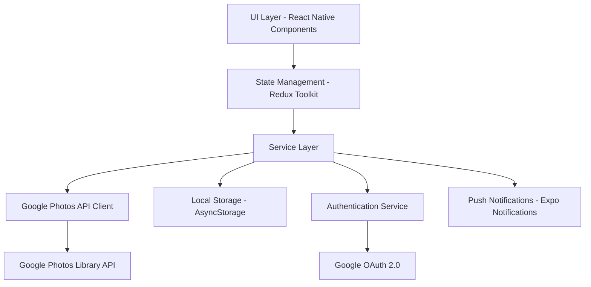

# Design Document

## Overview

Pictia is architected as a React Native + Expo mobile application that provides a seamless photo organization and backup experience across Android and iOS platforms. The application follows a modular architecture with clear separation of concerns, leveraging the Google Photos Library API for media access and management. The design emphasizes performance, security, and user experience through efficient state management, secure authentication handling, and intuitive UI components.

## Architecture

### High-Level Architecture



### Technology Stack

- **Frontend Framework**: React Native with Expo SDK
- **State Management**: Redux Toolkit with RTK Query for API caching
- **Authentication**: Expo AuthSession with Google OAuth 2.0
- **API Integration**: Google Photos Library API v1 (with latest 2024 updates)
- **Local Storage**: Expo SecureStore for tokens, AsyncStorage for app data
- **Notifications**: Expo Notifications
- **Navigation**: React Navigation v6
- **UI Components**: React Native Elements + custom components
- **Gesture Handling**: React Native Gesture Handler for swipe interactions

### Important API Updates & Developer Configuration Notes

⚠️ **DEVELOPER ACTION REQUIRED**: The following configurations must be completed in Google Cloud Console:

1. **Google Photos Library API Changes (2024)**:
   - New scopes required for media upload: `https://www.googleapis.com/auth/photoslibrary.appendonly`
   - Updated rate limits: 10,000 requests per day for free tier
   - New media upload endpoint with enhanced metadata support

2. **Google Cloud Console Configuration**:
   - Enable Google Photos Library API in your project
   - Configure OAuth 2.0 credentials with correct redirect URIs
   - For Expo development: `https://auth.expo.io/@your-username/your-app-slug`
   - For production: Custom scheme like `com.yourcompany.pictia://oauth`
   - Add authorized domains for web testing

3. **Testing Environment Setup**:
   - Use test Google account with limited photo library
   - Configure development OAuth client separately from production
   - Set up proper CORS policies for web testing
   - Ensure redirect URLs match exactly (case-sensitive)

## Components and Interfaces

### Core Components

#### 1. Authentication Module
```typescript
interface AuthService {
  authenticate(): Promise<AuthResult>
  refreshToken(): Promise<string>
  logout(): Promise<void>
  isAuthenticated(): boolean
}

interface AuthResult {
  accessToken: string
  refreshToken: string
  expiresIn: number
  user: UserProfile
}
```

#### 2. Google Photos API Client
```typescript
interface GooglePhotosClient {
  getMediaItems(pageToken?: string): Promise<MediaItemsResponse>
  uploadMediaItem(mediaData: MediaUpload): Promise<MediaItem>
  createAlbum(albumName: string): Promise<Album>
  addMediaToAlbum(albumId: string, mediaIds: string[]): Promise<void>
  // Updated 2024 API methods
  batchCreateMediaItems(items: NewMediaItem[]): Promise<BatchCreateResponse>
  getSharedAlbums(): Promise<SharedAlbumsResponse>
}

// Updated interfaces for 2024 API changes
interface MediaUpload {
  uploadToken: string // Required for new upload flow
  fileName: string
  description?: string
  newMediaItem: NewMediaItem
}

interface NewMediaItem {
  description?: string
  simpleMediaItem: {
    fileName: string
    uploadToken: string
  }
}

interface MediaItem {
  id: string
  filename: string
  mimeType: string
  baseUrl: string
  mediaMetadata: MediaMetadata
}
```

#### 3. Swipe Organization Interface
```typescript
interface SwipeCard {
  mediaItem: MediaItem
  onSwipeLeft: (item: MediaItem) => void
  onSwipeRight: (item: MediaItem) => void
  onUndo: () => void
  undoTimeoutMs: number
}

interface OrganizationState {
  currentIndex: number
  mediaItems: MediaItem[]
  keepItems: MediaItem[]
  deleteItems: MediaItem[]
  lastAction: SwipeAction | null
  undoAvailable: boolean
}
```

#### 4. Backup Management System
```typescript
interface BackupService {
  scheduleBackup(config: BackupConfig): Promise<void>
  triggerManualBackup(): Promise<BackupResult>
  getBackupHistory(): Promise<BackupLog[]>
  cancelBackup(backupId: string): Promise<void>
}

interface BackupConfig {
  frequency: 'weekly' | 'monthly'
  dayOfMonth?: number
  dayOfWeek?: number
  notificationEnabled: boolean
  notificationOffset: number // hours before backup
}
```

### UI Component Hierarchy

```
App
├── AuthNavigator
│   ├── LoginScreen
│   └── AuthLoadingScreen
└── MainNavigator
    ├── OrganizeScreen
    │   ├── SwipeCardStack
    │   ├── UndoButton
    │   └── ProgressIndicator
    ├── BackupScreen
    │   ├── BackupControls
    │   ├── ScheduleSettings
    │   └── BackupHistory
    ├── UploadScreen
    │   ├── MediaPicker
    │   ├── UploadProgress
    │   └── ConfigurationPanel
    └── SettingsScreen
        ├── NotificationSettings
        ├── AccountInfo
        └── AppPreferences
```

## Data Models

### Core Data Models

#### User Profile
```typescript
interface UserProfile {
  id: string
  email: string
  name: string
  profilePictureUrl?: string
  quotaUsed: number
  quotaLimit: number
}
```

#### Media Organization
```typescript
interface MediaOrganization {
  mediaItemId: string
  action: 'keep' | 'delete'
  timestamp: Date
  undoExpiry?: Date
}

interface OrganizationSession {
  id: string
  startTime: Date
  endTime?: Date
  totalItems: number
  processedItems: number
  keepCount: number
  deleteCount: number
}
```

#### Backup Management
```typescript
interface BackupLog {
  id: string
  type: 'scheduled' | 'manual'
  startTime: Date
  endTime?: Date
  status: 'pending' | 'in_progress' | 'completed' | 'failed'
  itemsUploaded: number
  totalItems: number
  errorMessage?: string
}

interface BackupProgress {
  backupId: string
  currentItem: number
  totalItems: number
  currentFileName: string
  bytesUploaded: number
  totalBytes: number
}
```

### Local Storage Schema

#### Secure Storage (Expo SecureStore)
- `auth_tokens`: Encrypted authentication tokens
- `refresh_token`: Encrypted refresh token
- `user_profile`: Encrypted user profile data

#### AsyncStorage
- `backup_config`: Backup configuration settings
- `organization_sessions`: Historical organization sessions
- `backup_logs`: Backup history and logs
- `app_preferences`: User preferences and settings

## Error Handling

### Error Categories and Handling Strategies

#### 1. Authentication Errors
```typescript
enum AuthErrorType {
  INVALID_CREDENTIALS = 'invalid_credentials',
  TOKEN_EXPIRED = 'token_expired',
  NETWORK_ERROR = 'network_error',
  PERMISSION_DENIED = 'permission_denied',
  INVALID_REDIRECT_URI = 'invalid_redirect_uri', // Common config issue
  SCOPE_INSUFFICIENT = 'scope_insufficient' // New API scope requirements
}

class AuthErrorHandler {
  handle(error: AuthError): Promise<void> {
    switch (error.type) {
      case AuthErrorType.TOKEN_EXPIRED:
        return this.refreshTokens()
      case AuthErrorType.INVALID_CREDENTIALS:
        return this.redirectToLogin()
      case AuthErrorType.INVALID_REDIRECT_URI:
        return this.showConfigurationError('Redirect URI mismatch - check Google Cloud Console')
      case AuthErrorType.SCOPE_INSUFFICIENT:
        return this.showConfigurationError('Missing required scopes - update OAuth configuration')
      default:
        return this.showErrorMessage(error.message)
    }
  }
}
```

#### 2. API Errors
```typescript
interface APIErrorHandler {
  handleRateLimit(retryAfter: number): Promise<void>
  handleQuotaExceeded(): Promise<void>
  handleNetworkError(): Promise<void>
  handleServerError(statusCode: number): Promise<void>
}
```

#### 3. Upload Errors
```typescript
interface UploadErrorRecovery {
  retryFailedUploads(): Promise<void>
  pauseAndResumeUpload(uploadId: string): Promise<void>
  handleInsufficientStorage(): Promise<void>
  validateMediaFormat(file: MediaFile): boolean
}
```

### Error Recovery Mechanisms

1. **Exponential Backoff**: For API rate limiting and temporary failures
2. **Offline Queue**: Store failed operations for retry when connectivity returns
3. **Graceful Degradation**: Continue core functionality when non-critical features fail
4. **User Feedback**: Clear error messages with actionable recovery steps

## Testing Strategy

### Testing Pyramid

#### 1. Unit Tests (70%)
- **Service Layer**: Authentication, API clients, backup logic
- **Utility Functions**: Data transformations, validation, formatting
- **State Management**: Redux reducers, selectors, actions
- **Business Logic**: Organization algorithms, scheduling logic

```typescript
// Example test structure
describe('BackupService', () => {
  describe('scheduleBackup', () => {
    it('should schedule monthly backup correctly')
    it('should handle invalid date configurations')
    it('should update existing schedules')
  })
})
```

#### 2. Integration Tests (20%)
- **API Integration**: Google Photos API interactions
- **Authentication Flow**: OAuth flow end-to-end
- **Data Persistence**: Storage and retrieval operations
- **Cross-Component Communication**: State updates across components

#### 3. End-to-End Tests (10%)
- **Critical User Journeys**: Login → Organize → Backup flow
- **Platform-Specific Behavior**: Android vs iOS differences
- **Error Scenarios**: Network failures, authentication issues
- **Performance Testing**: Large photo sets, memory usage

### Testing Tools and Framework

- **Unit Testing**: Jest + React Native Testing Library
- **Integration Testing**: Jest with mocked API responses
- **E2E Testing**: Detox for React Native
- **Performance Testing**: Flipper + React Native Performance Monitor
- **API Testing**: Mock Service Worker for API mocking

### Test Data Management

```typescript
interface TestDataFactory {
  createMediaItem(overrides?: Partial<MediaItem>): MediaItem
  createBackupConfig(overrides?: Partial<BackupConfig>): BackupConfig
  createUserProfile(overrides?: Partial<UserProfile>): UserProfile
  generateMediaItemBatch(count: number): MediaItem[]
}
```

### Continuous Integration

1. **Pre-commit Hooks**: Linting, type checking, unit tests
2. **Pull Request Checks**: Full test suite, build verification
3. **Automated Testing**: Run tests on multiple device simulators
4. **Performance Monitoring**: Bundle size analysis, memory leak detection

### Manual Testing Checklist

#### Core Functionality
- [ ] Google authentication flow
- [ ] Photo loading and display
- [ ] Swipe gestures (left/right)
- [ ] Undo functionality timing
- [ ] Manual backup trigger
- [ ] Scheduled backup execution

#### Platform-Specific Testing
- [ ] Android gesture handling
- [ ] iOS gesture handling
- [ ] Push notification delivery
- [ ] Background task execution
- [ ] Storage permissions

#### Edge Cases
- [ ] No internet connectivity
- [ ] Large photo collections (1000+ items)
- [ ] Storage quota exceeded
- [ ] Authentication token expiry
- [ ] App backgrounding during upload

## Developer Configuration Alerts

### Critical Setup Requirements

The following configurations will require developer intervention and may cause implementation blockers if not properly configured:

#### Google Cloud Console Setup
🚨 **REQUIRED BEFORE DEVELOPMENT**:
1. **Project Setup**: Create/select Google Cloud project
2. **API Enablement**: Enable Google Photos Library API
3. **OAuth Credentials**: Create OAuth 2.0 client ID
4. **Redirect URIs**: Configure exact redirect URLs (case-sensitive)
5. **Scopes Configuration**: Ensure all required scopes are included

#### Development Environment Issues
⚠️ **COMMON PITFALLS**:
- Redirect URI mismatch between Expo config and Google Console
- Missing or incorrect API scopes for photo upload
- Rate limiting during development (10,000 requests/day limit)
- CORS issues when testing web components
- OAuth client type mismatch (mobile vs web)

#### Testing Account Setup
📋 **RECOMMENDED**:
- Use dedicated test Google account with limited photo library
- Separate OAuth clients for development/staging/production
- Test with various photo formats and sizes
- Verify quota limits don't block development

#### Runtime Configuration Validation
```typescript
interface ConfigValidator {
  validateGoogleCloudSetup(): Promise<ConfigValidationResult>
  checkAPIQuotaStatus(): Promise<QuotaStatus>
  verifyRedirectURIs(): Promise<boolean>
  testAPIConnectivity(): Promise<boolean>
}

// Implementation should alert developer when configuration issues detected
```

This comprehensive design provides a solid foundation for implementing Pictia with proper architecture, clear interfaces, robust error handling, and thorough testing strategies. The modular approach ensures maintainability and scalability as the application grows, while the configuration alerts help prevent common development blockers.