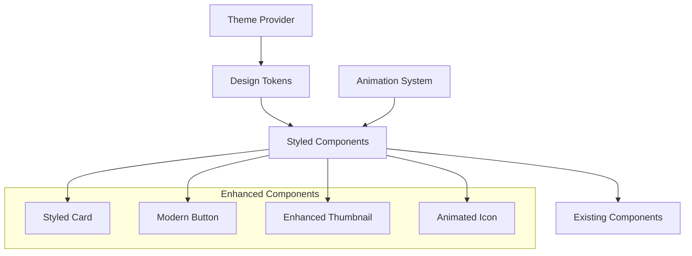

# Design Document

## Overview

This design document outlines the comprehensive UI personality enhancement for Pictia, transforming the current interface into a modern, engaging experience inspired by successful dating apps like Tinder. The enhancement focuses on visual design, animations, and micro-interactions while preserving all existing functionality. The approach uses a layered design system that wraps existing components with enhanced styling, ensuring a smooth implementation without breaking current features.

## Architecture

### Design System Architecture



### Implementation Strategy

The enhancement follows a **wrapper-based approach** where existing components are wrapped with styled containers and enhanced visual elements. This ensures:

1. **Functionality Preservation**: All existing logic remains intact
2. **Incremental Implementation**: Components can be enhanced one at a time
3. **Rollback Safety**: Easy to revert changes if needed
4. **Performance Optimization**: Minimal impact on existing performance

## Components and Interfaces

### Core Design System

#### 1. Color Palette and Theme System

Inspired by the Tinder clone's sophisticated color scheme, adapted for photo organization:

```typescript
// Enhanced Color System
export const THEME_COLORS = {
  // Primary Colors (inspired by Tinder clone)
  PRIMARY: '#7444C0',           // Main brand color
  SECONDARY: '#5636B8',         // Secondary brand color
  ACCENT: '#B644B2',            // Accent for highlights
  
  // Functional Colors
  SUCCESS: '#46A575',           // Keep/positive actions
  DANGER: '#D04949',            // Delete/negative actions
  WARNING: '#FFA200',           // Caution/star actions
  INFO: '#5028D7',              // Information/flash actions
  
  // Neutral Colors
  WHITE: '#FFFFFF',
  LIGHT_GRAY: '#F8F9FA',
  GRAY: '#757E90',
  DARK_GRAY: '#363636',
  BLACK: '#000000',
  
  // Gradients
  PRIMARY_GRADIENT: ['#7444C0', '#5636B8'],
  ACCENT_GRADIENT: ['#B644B2', '#7444C0'],
  SUCCESS_GRADIENT: ['#46A575', '#2E8B57'],
  DANGER_GRADIENT: ['#D04949', '#B22222'],
};

// Theme Provider Interface
interface ThemeContextType {
  colors: typeof THEME_COLORS;
  isDarkMode: boolean;
  toggleTheme: () => void;
  spacing: SpacingSystem;
  typography: TypographySystem;
  shadows: ShadowSystem;
}
```

#### 2. Typography System

Modern, readable typography hierarchy:

```typescript
export const TYPOGRAPHY = {
  // Font Families
  PRIMARY_FONT: 'System', // Use system font for best performance
  
  // Font Sizes
  HEADING_LARGE: 28,
  HEADING_MEDIUM: 22,
  HEADING_SMALL: 18,
  BODY_LARGE: 16,
  BODY_MEDIUM: 14,
  BODY_SMALL: 12,
  CAPTION: 10,
  
  // Font Weights
  WEIGHT_LIGHT: '300',
  WEIGHT_REGULAR: '400',
  WEIGHT_MEDIUM: '500',
  WEIGHT_SEMIBOLD: '600',
  WEIGHT_BOLD: '700',
  
  // Line Heights
  LINE_HEIGHT_TIGHT: 1.2,
  LINE_HEIGHT_NORMAL: 1.4,
  LINE_HEIGHT_RELAXED: 1.6,
};
```

#### 3. Spacing and Layout System

Consistent spacing based on 8px grid system:

```typescript
export const SPACING = {
  XS: 4,
  SM: 8,
  MD: 16,
  LG: 24,
  XL: 32,
  XXL: 48,
  
  // Component-specific spacing
  CARD_PADDING: 20,
  BUTTON_PADDING: 16,
  SCREEN_PADDING: 20,
  GRID_SPACING: 12,
};

export const BORDER_RADIUS = {
  SM: 8,
  MD: 12,
  LG: 16,
  XL: 24,
  CIRCLE: 999,
};
```

#### 4. Shadow and Elevation System

Subtle shadows for depth and hierarchy:

```typescript
export const SHADOWS = {
  CARD: {
    shadowColor: THEME_COLORS.BLACK,
    shadowOffset: { width: 0, height: 2 },
    shadowOpacity: 0.1,
    shadowRadius: 8,
    elevation: 3,
  },
  
  BUTTON: {
    shadowColor: THEME_COLORS.BLACK,
    shadowOffset: { width: 0, height: 4 },
    shadowOpacity: 0.15,
    shadowRadius: 12,
    elevation: 5,
  },
  
  FLOATING: {
    shadowColor: THEME_COLORS.BLACK,
    shadowOffset: { width: 0, height: 8 },
    shadowOpacity: 0.2,
    shadowRadius: 16,
    elevation: 8,
  },
};
```

### Enhanced Component Specifications

#### 1. Styled Card Component

Enhanced version of the existing SwipeCard with modern styling:

```typescript
interface StyledCardProps {
  children: React.ReactNode;
  variant?: 'default' | 'elevated' | 'minimal';
  onSwipeLeft?: () => void;
  onSwipeRight?: () => void;
  showActions?: boolean;
  isAnimating?: boolean;
}

// Visual Specifications
const CARD_STYLES = {
  container: {
    backgroundColor: THEME_COLORS.WHITE,
    borderRadius: BORDER_RADIUS.LG,
    ...SHADOWS.CARD,
    margin: SPACING.MD,
    overflow: 'hidden',
  },
  
  image: {
    width: '100%',
    height: 400,
    borderTopLeftRadius: BORDER_RADIUS.LG,
    borderTopRightRadius: BORDER_RADIUS.LG,
  },
  
  content: {
    padding: SPACING.CARD_PADDING,
  },
  
  // Animation states
  swipeLeft: {
    transform: [{ rotate: '-15deg' }, { translateX: -300 }],
    opacity: 0,
  },
  
  swipeRight: {
    transform: [{ rotate: '15deg' }, { translateX: 300 }],
    opacity: 0,
  },
};
```

#### 2. Modern Button System

Circular and rectangular button variants with gradients:

```typescript
interface ModernButtonProps {
  variant: 'primary' | 'secondary' | 'success' | 'danger' | 'minimal';
  size: 'small' | 'medium' | 'large';
  shape: 'circle' | 'rounded' | 'pill';
  icon?: string;
  text?: string;
  onPress: () => void;
  disabled?: boolean;
  loading?: boolean;
}

// Button Specifications
const BUTTON_VARIANTS = {
  primary: {
    backgroundColor: THEME_COLORS.PRIMARY,
    gradient: THEME_COLORS.PRIMARY_GRADIENT,
  },
  
  success: {
    backgroundColor: THEME_COLORS.SUCCESS,
    gradient: THEME_COLORS.SUCCESS_GRADIENT,
  },
  
  danger: {
    backgroundColor: THEME_COLORS.DANGER,
    gradient: THEME_COLORS.DANGER_GRADIENT,
  },
};

const BUTTON_SIZES = {
  small: { width: 40, height: 40, iconSize: 16 },
  medium: { width: 60, height: 60, iconSize: 24 },
  large: { width: 80, height: 80, iconSize: 32 },
};
```

#### 3. Enhanced Photo Thumbnail

Modern grid item with selection states and review indicators:

```typescript
interface EnhancedThumbnailProps {
  mediaItem: MediaItem;
  isSelected: boolean;
  isReviewed: boolean;
  onPress: () => void;
  onLongPress: () => void;
  size: number;
}

const THUMBNAIL_STYLES = {
  container: {
    borderRadius: BORDER_RADIUS.MD,
    overflow: 'hidden',
    ...SHADOWS.CARD,
  },
  
  image: {
    width: '100%',
    height: '100%',
  },
  
  overlay: {
    position: 'absolute',
    top: 0,
    left: 0,
    right: 0,
    bottom: 0,
    backgroundColor: 'rgba(116, 68, 192, 0.3)',
    justifyContent: 'center',
    alignItems: 'center',
  },
  
  reviewIndicator: {
    position: 'absolute',
    top: 8,
    right: 8,
    width: 20,
    height: 20,
    borderRadius: 10,
    backgroundColor: THEME_COLORS.SUCCESS,
    justifyContent: 'center',
    alignItems: 'center',
  },
};
```

#### 4. Enhanced Navigation System

Modern bottom tab bar with animations:

```typescript
interface EnhancedTabBarProps {
  state: any;
  descriptors: any;
  navigation: any;
}

const TAB_BAR_STYLES = {
  container: {
    backgroundColor: THEME_COLORS.WHITE,
    borderTopWidth: 0,
    ...SHADOWS.CARD,
    paddingBottom: 20,
    paddingTop: 10,
  },
  
  tab: {
    flex: 1,
    alignItems: 'center',
    justifyContent: 'center',
    paddingVertical: 8,
  },
  
  activeTab: {
    transform: [{ scale: 1.1 }],
  },
  
  tabIcon: {
    marginBottom: 4,
  },
  
  tabLabel: {
    fontSize: TYPOGRAPHY.BODY_SMALL,
    fontWeight: TYPOGRAPHY.WEIGHT_MEDIUM,
  },
};
```

## Data Models

### Theme Configuration

```typescript
interface ThemeConfig {
  id: string;
  name: string;
  colors: ColorPalette;
  typography: TypographyConfig;
  spacing: SpacingConfig;
  animations: AnimationConfig;
}

interface ColorPalette {
  primary: string;
  secondary: string;
  accent: string;
  success: string;
  danger: string;
  warning: string;
  info: string;
  background: string;
  surface: string;
  text: string;
  textSecondary: string;
}

interface AnimationConfig {
  duration: {
    fast: number;
    normal: number;
    slow: number;
  };
  easing: {
    easeIn: string;
    easeOut: string;
    easeInOut: string;
  };
}
```

### Component State Models

```typescript
interface CardAnimationState {
  translateX: Animated.Value;
  translateY: Animated.Value;
  rotate: Animated.Value;
  scale: Animated.Value;
  opacity: Animated.Value;
}

interface ButtonState {
  isPressed: boolean;
  isLoading: boolean;
  isDisabled: boolean;
  animationValue: Animated.Value;
}

interface ThemeState {
  currentTheme: 'light' | 'dark';
  colors: ColorPalette;
  animations: AnimationConfig;
  accessibility: AccessibilityConfig;
}
```

## Animation System

### Core Animation Principles

1. **Smooth Transitions**: All animations use React Native Reanimated for 60fps performance
2. **Meaningful Motion**: Animations guide user attention and provide feedback
3. **Consistent Timing**: Standardized duration and easing curves
4. **Respectful of Preferences**: Honor reduced motion accessibility settings

### Animation Specifications

#### 1. Card Swipe Animations

```typescript
const SWIPE_ANIMATIONS = {
  // Gesture-driven animations
  swipeGesture: {
    translateX: withSpring(gestureX, {
      damping: 20,
      stiffness: 90,
    }),
    rotate: withSpring(gestureX * 0.1, {
      damping: 20,
      stiffness: 90,
    }),
  },
  
  // Exit animations
  swipeExit: {
    translateX: withTiming(direction * 400, {
      duration: 300,
      easing: Easing.out(Easing.cubic),
    }),
    opacity: withTiming(0, {
      duration: 300,
    }),
  },
  
  // Return to center
  snapBack: {
    translateX: withSpring(0),
    rotate: withSpring(0),
    scale: withSpring(1),
  },
};
```

#### 2. Button Press Animations

```typescript
const BUTTON_ANIMATIONS = {
  pressIn: {
    scale: withTiming(0.95, { duration: 100 }),
    opacity: withTiming(0.8, { duration: 100 }),
  },
  
  pressOut: {
    scale: withSpring(1, { damping: 15 }),
    opacity: withTiming(1, { duration: 150 }),
  },
  
  loading: {
    rotate: withRepeat(
      withTiming(360, { duration: 1000 }),
      -1,
      false
    ),
  },
};
```

#### 3. Screen Transition Animations

```typescript
const SCREEN_TRANSITIONS = {
  slideFromRight: {
    cardStyleInterpolator: ({ current, layouts }) => ({
      cardStyle: {
        transform: [
          {
            translateX: current.progress.interpolate({
              inputRange: [0, 1],
              outputRange: [layouts.screen.width, 0],
            }),
          },
        ],
      },
    }),
  },
  
  fadeIn: {
    cardStyleInterpolator: ({ current }) => ({
      cardStyle: {
        opacity: current.progress,
      },
    }),
  },
};
```

## Error Handling

### Visual Error States

Enhanced error handling with visually appealing error states:

```typescript
interface ErrorDisplayProps {
  error: Error;
  onRetry?: () => void;
  variant: 'inline' | 'fullscreen' | 'toast';
}

const ERROR_STYLES = {
  container: {
    backgroundColor: THEME_COLORS.WHITE,
    borderRadius: BORDER_RADIUS.LG,
    padding: SPACING.LG,
    margin: SPACING.MD,
    ...SHADOWS.CARD,
  },
  
  icon: {
    color: THEME_COLORS.DANGER,
    fontSize: 48,
    marginBottom: SPACING.MD,
  },
  
  title: {
    fontSize: TYPOGRAPHY.HEADING_SMALL,
    fontWeight: TYPOGRAPHY.WEIGHT_SEMIBOLD,
    color: THEME_COLORS.DARK_GRAY,
    textAlign: 'center',
    marginBottom: SPACING.SM,
  },
  
  message: {
    fontSize: TYPOGRAPHY.BODY_MEDIUM,
    color: THEME_COLORS.GRAY,
    textAlign: 'center',
    marginBottom: SPACING.LG,
  },
};
```

### Loading States

Engaging loading animations and skeleton screens:

```typescript
interface LoadingStateProps {
  variant: 'spinner' | 'skeleton' | 'shimmer';
  size?: 'small' | 'medium' | 'large';
}

const LOADING_ANIMATIONS = {
  spinner: {
    rotate: withRepeat(
      withTiming(360, { duration: 1000 }),
      -1,
      false
    ),
  },
  
  shimmer: {
    translateX: withRepeat(
      withTiming(200, { duration: 1500 }),
      -1,
      false
    ),
  },
  
  pulse: {
    opacity: withRepeat(
      withSequence(
        withTiming(0.5, { duration: 800 }),
        withTiming(1, { duration: 800 })
      ),
      -1,
      true
    ),
  },
};
```

## Testing Strategy

### Visual Regression Testing

1. **Component Screenshots**: Automated screenshots of all enhanced components
2. **Theme Testing**: Verify all components work with light/dark themes
3. **Animation Testing**: Ensure animations complete correctly
4. **Accessibility Testing**: Verify enhanced components maintain accessibility

### Performance Testing

1. **Animation Performance**: Monitor frame rates during animations
2. **Memory Usage**: Ensure enhanced components don't increase memory usage significantly
3. **Bundle Size**: Track impact on app bundle size
4. **Startup Time**: Verify theme loading doesn't impact startup performance

### User Experience Testing

1. **A/B Testing**: Compare enhanced vs original components
2. **Usability Testing**: Verify enhanced design improves usability
3. **Accessibility Testing**: Test with screen readers and accessibility tools
4. **Cross-Platform Testing**: Ensure consistent experience on iOS and Android

## Implementation Guidelines

### Phase 1: Foundation (Design System)
1. Create theme provider and design tokens
2. Implement base styled components
3. Set up animation system
4. Create component library structure

### Phase 2: Core Components
1. Enhance SwipeCard with new styling
2. Update button components
3. Improve photo thumbnails
4. Enhance navigation tabs

### Phase 3: Screen-Level Enhancements
1. Update gallery screen layout
2. Enhance settings screens
3. Improve loading and error states
4. Add onboarding enhancements

### Phase 4: Polish and Optimization
1. Fine-tune animations
2. Optimize performance
3. Add accessibility improvements
4. Conduct user testing and refinements

### Migration Strategy

The enhancement follows a **gradual migration approach**:

1. **Wrapper Components**: Create enhanced versions that wrap existing components
2. **Feature Flags**: Use feature flags to toggle between old and new designs
3. **Incremental Rollout**: Enable enhancements screen by screen
4. **Fallback Support**: Maintain ability to revert to original design if needed

This design provides a comprehensive foundation for transforming Pictia's interface into a modern, engaging experience while preserving all existing functionality and ensuring a smooth implementation process.